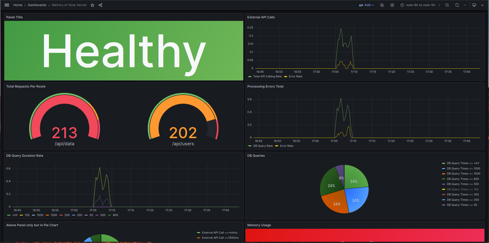
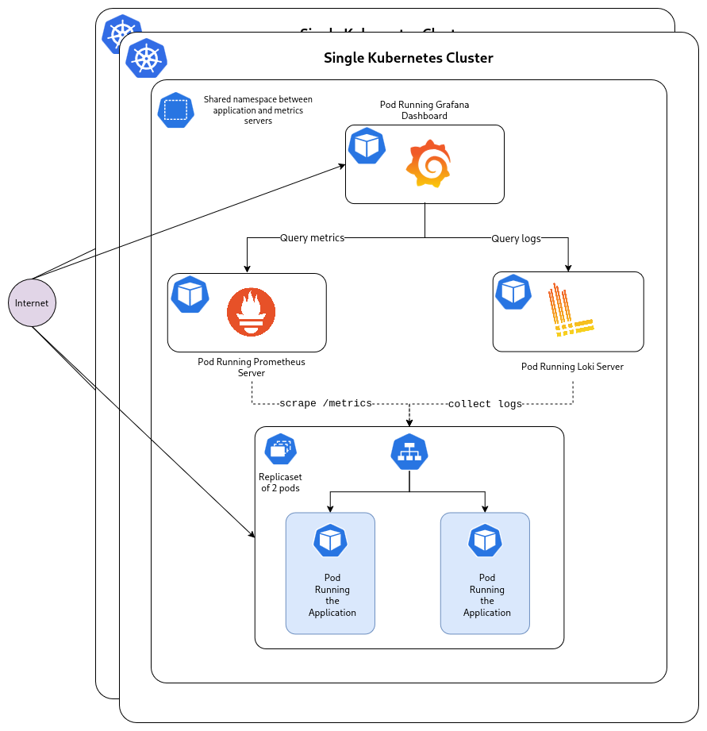

# Atlan-Assignment a Slow Server

A Sample Go server that intentionally
simulates high response times and errors for monitoring, and observability demonstrations.

This project uses Docker Containers running inside a K8 cluster
that contains 2 Public facing services(Grafana Dashboard, application server) and private nodes for Prometheus and Loki. 

Added Metrics Screenshot:

High Level Design: 

All the K8 Config is included in k8s/ directory.
## Getting Started

### Prerequisites

- Go 1.21 or higher
- Git

### Installation

Run `deploy.sh` and see this k8 cluster take away 4G's of ram easy

## Configuration

Configuration is done through environment variables:

| Variable | Description | Default |
|----------|-------------|---------|
| SERVER_PORT | HTTP server port | 8080 |
| LOG_LEVEL | Logging level (debug, info, warn, error) | info |
| SIMULATE_ERRORS | Whether to simulate errors |
